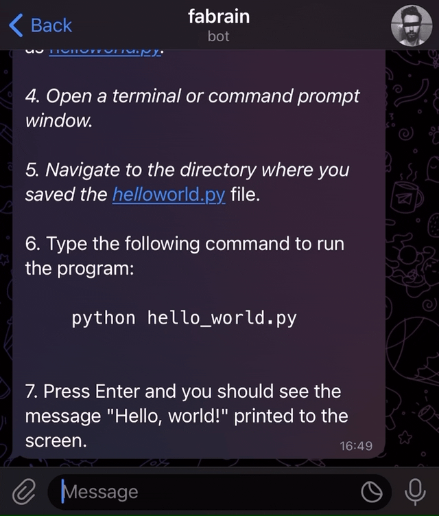

# ChatGPT Telegram Bot on Cloudflare Workers

A minimal example of a Telegram Bot for ChatGPT running on a Cloudflare Worker.

## Setup

1. Get your new bot token from [@BotFather](https://t.me/botfather): https://core.telegram.org/bots#6-botfather
2. Get an OpenAI API key: https://platform.openai.com/account/api-keys
3. Sign up to Cloudflare Workers: https://workers.cloudflare.com/
4. In the Cloudflare Dashboard go to "Workers" and then click "Create a Service"
5. Choose a name and click "Create a Service" to create the worker
6. Click on "Quick Edit" to change the source code of your new worker
7. Copy and paste the code from [bot.js](bot.js) into the editor
8. Replace the `TOKEN` variable in the code with your token from [@BotFather](https://t.me/botfather)
9. Replace the `API_KEY` variable in the code with your OpenAI API key
10. Optional: Change the `WEBHOOK` variable to a different path and the `SECRET` variable to a random secret. See https://core.telegram.org/bots/api#setwebhook
11. Click on "Save and Deploy"
12. In the middle panel append `/registerWebhook` to the url. For example: https://my-worker-123.username.workers.dev/registerWebhook
13. Click "Send". In the right panel should appear `Ok`. If 401 Unauthorized appears, you may have used a wrong bot token.
14. That's it, now you can send a ChatGPT prompt to your Telegram bot

## Demo

